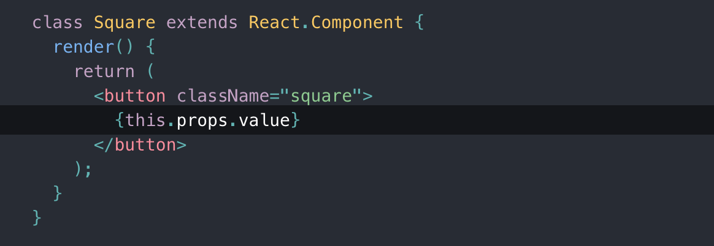

## React.Component

### render 
returns a React element

> The `<div />` syntax is transformed at build time to ReactCreateElement('div') expression 的传递都是 {}
### Classes
1. Classes are in fact "special functions", and just as you can define function expressions and function declarations, the class syntax has two components: class expressions and class declarations.
2.  An important difference between function declarations and class declarations is that function declarations are hoisted and class declarations are not. You first need to declare your class and then access it, otherwise code like the following will throw a ReferenceError:
3.  A constructor can use the `super()` keyword to call the constructor of the super class.
### return element
```javascript
renderSquare(i) {
  return <Square value={this.state.squares[i]} />;
}
```

```javascript
renderSquare(i) {
  return (
    <Square
      value={this.state.squares[i]}
      onClick={() => this.handleClick(i)}
    />
  );
}
```
>We split the returned element into multiple lines for readability, and added parentheses around it so that JavaScript doesn’t insert a semicolon after return and break our code.
### constructor
>Delete constructor definition from Square because it doesn’t have state anymore.
### Functional Components
React supports a simpler syntax called functional components for component types like Square that only consist of a render method. Rather than define a class extending React.Component, simply write a function that takes props and returns what should be rendered.
```javascript
function Square(props) {
  return (
    <button className="square" onClick={props.onClick}>
      {props.value}
    </button>
  );
}
```
### render Scope
```
onClick = { this.handleClick }
```
```
onClick = { () => { this.handleClick() } }
```
### Keys
>key is a special property that’s reserved by React (along with ref, a more advanced feature). When an element is created, React pulls off the key property and stores the key directly on the returned element. Even though it may look like it is part of props, it cannot be referenced with this.props.key. React uses the key automatically while deciding which children to update; there is no way for a component to inquire about its own key.

>It’s strongly recommended that you assign proper keys whenever you build dynamic lists.

> Explicitly passing key={i} silences the warning but has the same problem so isn’t recommended in most cases.