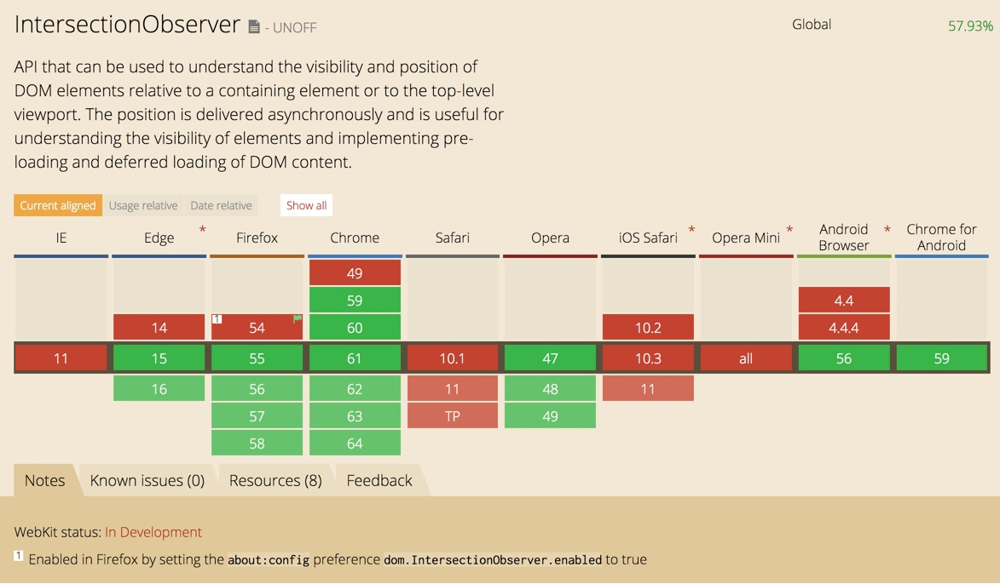

# 如何解决判断可见性问题？
## 从前我们都是通过监听滚动事件、resize 事件来判断模块是否可见，代码不仅繁琐，而且一不小心没有函数去抖就又可能导致严重的性能问题。
现在我们有了更好的选择—— IntersectionObserver API ，IntersectionObserver 允许你配置一个回调函数，每当 target ，元素和设备视口或者其他指定元素发生交集的时候该回调函数将会被执行。这个 API 的设计是异步的，而且保证你的回调执行次数是非常有限的，而且回调是会在主线程空闲时才执行，在性能方面表现更优，使用起来也更简单。

目前是现代浏览器支持，低版本浏览器可以通过 polyfill 兼容。